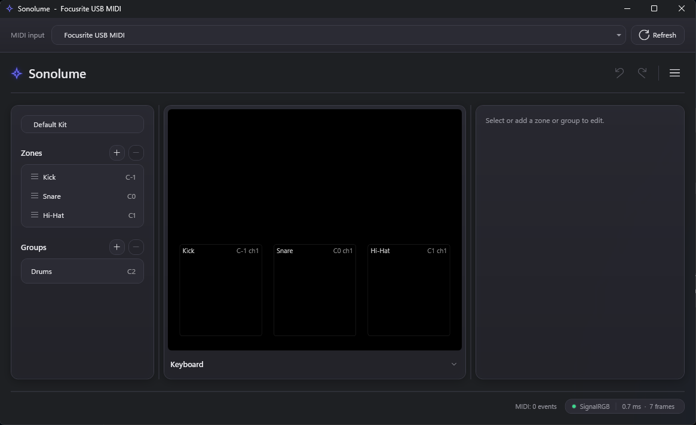
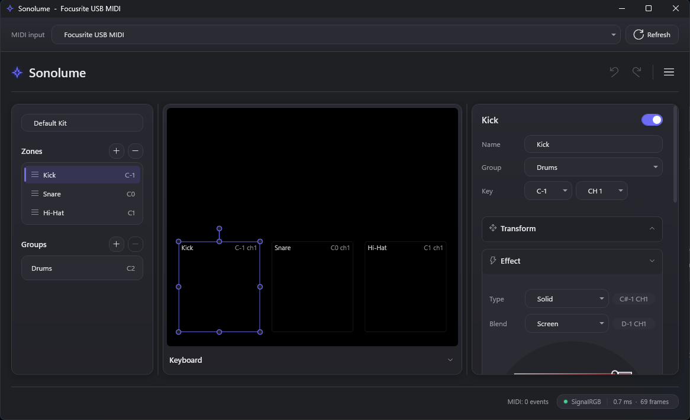

# Sonolume

**Turn sound into light.** Sonolume maps MIDI — notes, velocity, CCs — to lighting zones and effects, and drives your RGB hardware live through [SignalRGB](https://signalrgb.com/). Play a kick drum, a hi-hat flashes. Hold a chord, a zone pulses in your chosen color. It runs as a VST3 instrument inside your DAW, or standalone with any MIDI controller.

```
DAW / MIDI controller  --MIDI-->  Sonolume  --regions-->  SignalRGB canvas  --device layout-->  RGB hardware
```



## Features

- **Zones and groups** — draw rectangular regions on a virtual canvas, position/size/rotate them, and organize them into groups for shared effects.
- **9 built-in effects** — Solid, Flash, Pulse, Strobe, Chase, Ripple, Sparkle, Rainbow, Wave — each with its own color and parameters.
- **Blend modes** — Normal, Additive, Multiply, Screen, Max — for layering overlapping zones.
- **MIDI mapping** — assign any note or CC to a zone or group, per MIDI channel.
- **Import your real layout** — pull device positions straight from SignalRGB, or enter them by hand when SignalRGB can't report a position (e.g. multi-component controllers).
- **Undo/redo and projects** — save, open, and reopen recent kits.
- **Works two ways** — a VST3 plugin hosted by your DAW, or a standalone app driven by any class-compliant MIDI controller.

## Requirements

- Windows 11
- [SignalRGB](https://signalrgb.com/) (uses the free Canvas API — no Pro subscription needed)
- A DAW that hosts VST3 (tested with REAPER), or a MIDI controller/keyboard for the standalone app

## Install

1. **Effect:** run `tools\install-effect.ps1` to copy `Sonolume.html` into your SignalRGB effects folder. Restart SignalRGB once, then select **Sonolume** in the effect library.
2. **Plugin:** run `tools\install-plugin.ps1` (elevated shell) to copy the build output to `C:\Program Files\Common Files\VST3\Sonolume`. Rescan plugins in your DAW and insert **Sonolume** as an instrument.
3. **Standalone (no DAW needed):** run `src\Sonolume.Standalone\bin\Release\net10.0-windows\Sonolume.Standalone.exe`, pick a MIDI input, and play.

(No release build yet — see [Build it yourself](#build-it-yourself) below.)

## Usage

1. **Open SignalRGB** and select the **Sonolume** effect from its library.
2. **Launch Sonolume** — standalone, or by inserting the plugin on a DAW track — and pick your MIDI input (or let the DAW feed it notes).
3. **Pick a MIDI input** from the dropdown at the top of the window (standalone only; a plugin instance uses the host's MIDI).
4. **Select or add a zone** in the left panel. Drag its handles on the canvas preview to position and size it.
5. **Assign a key** — the note (or CC) and channel that triggers it — in the zone panel on the right.
6. **Choose an effect and color**, expanding the **Effect** section to pick type, blend mode, and color/params.
7. **Group zones** that should react together (e.g. a whole drum kit flashing to a beat).
8. **Play.** Velocity drives brightness; each effect decays, pulses, or animates on its own timing.
9. **Save your project** (hamburger menu → Save/Save As) and reopen it later from **Open Recent**.



Already have a SignalRGB layout set up? Use **Import from SignalRGB** in the hamburger menu to pull real device positions in automatically, or **Manual Import** to enter a device's position by hand.

### Status

Actively developed. The default kit ships with three zones (kick/snare/hi-hat) as a starting point — build out your own zones, groups, and effects from there.

---

## Developer setup

### Requirements

- Windows 11
- .NET 10 SDK
- SignalRGB installed, for end-to-end testing

### Build and test

```powershell
dotnet build Sonolume.slnx -c Release
dotnet test Sonolume.slnx
```

### Project layout

- `src/Sonolume.Engine` — MIDI interpretation, mapping, effects, and compositing. Plain class library, no plugin/UI/network dependencies.
- `src/Sonolume.Transport` — SignalRGB Canvas API client and MCP layout-import client.
- `src/Sonolume.Persist` — project file save/load.
- `src/Sonolume.UI` — WPF views shared by the plugin and standalone host.
- `src/Sonolume.Plugin` — VST3 shell (AudioPlugSharp).
- `src/Sonolume.Standalone` — standalone WPF app (DryWetMIDI for MIDI input).
- `signalrgb-effect/` — the SignalRGB effect (HTML/JS renderer); built by `tools/install-effect.ps1`.
- `tools/` — install scripts, `Sonolume.MidiSend` (test MIDI sender), `canvas-probe.ps1` (SignalRGB Canvas API load testing).
- `tests/` — engine and UI test suites.

See `docs/architecture.md` for the design and decisions, and `docs/protocol.md` for the wire format and SignalRGB measurements. The original product brief is `plan.txt`.
